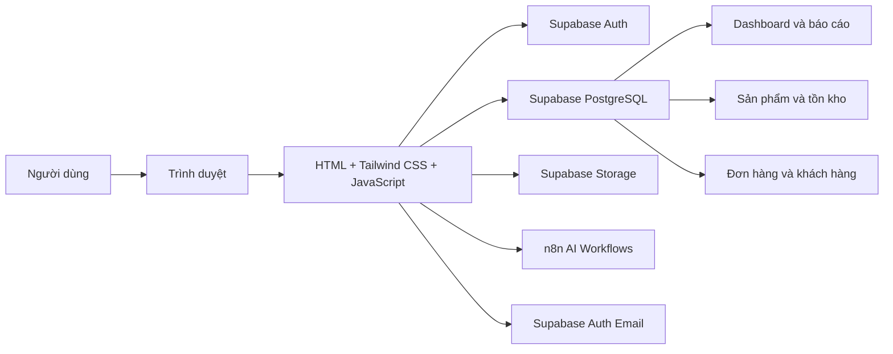
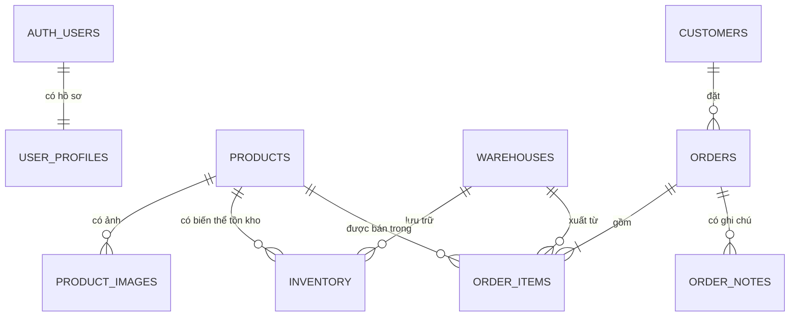

# Biti's Management System

Hệ thống quản trị nội bộ dành cho hoạt động bán hàng của Biti's, bao gồm báo cáo kinh doanh, quản lý sản phẩm, tồn kho theo kích cỡ và kho hàng, xử lý đơn hàng, quản lý nhân sự, hồ sơ người dùng và trợ lý AI.

Ứng dụng được xây dựng dưới dạng website tĩnh, không có bước build. Toàn bộ giao diện và logic nghiệp vụ chạy trên trình duyệt, kết nối trực tiếp đến Supabase để xác thực, truy vấn dữ liệu và lưu trữ hình ảnh.

## Mục lục

- [Tính năng chính](#tính-năng-chính)
- [Công nghệ sử dụng](#công-nghệ-sử-dụng)
- [Kiến trúc hệ thống](#kiến-trúc-hệ-thống)
- [Cấu trúc dự án](#cấu-trúc-dự-án)
- [Hướng dẫn chạy dự án](#hướng-dẫn-chạy-dự-án)
- [Cấu hình Supabase](#cấu-hình-supabase)
- [Mô hình dữ liệu](#mô-hình-dữ-liệu)
- [Phân quyền](#phân-quyền)
- [Tích hợp AI và dịch vụ ngoài](#tích-hợp-ai-và-dịch-vụ-ngoài)
- [Quy ước phát triển](#quy-ước-phát-triển)
- [Lưu ý triển khai](#lưu-ý-triển-khai)

## Tính năng chính

### 1. Dashboard và báo cáo kinh doanh

Trang `index.html` cung cấp hai chế độ báo cáo:

- **Báo cáo tổng quan:** doanh thu, số đơn, giá trị đơn trung bình, khách hàng, sản phẩm và tổng lượng tồn kho.
- **Báo cáo theo sản phẩm:** doanh thu, số lượng bán, số đơn chứa sản phẩm, giá bán trung bình, lượng tồn và số biến thể sắp hết hàng.

Người dùng có thể:

- Chọn khoảng ngày tùy ý hoặc dùng các mốc nhanh: hôm nay, 7 ngày, 30 ngày, tháng này và năm nay.
- Tìm sản phẩm theo tên, SKU, danh mục, bộ sưu tập hoặc màu sắc.
- Xem biểu đồ doanh thu, giá trị đơn hàng, thời điểm phát sinh đơn, trạng thái đơn và thanh toán.
- Phân tích sản phẩm theo danh mục, bộ sưu tập, màu sắc, khoảng giá, kích cỡ và kho hàng.
- Phân tích khách hàng mới, khách hàng quay lại và nhóm khách hàng có doanh thu cao.
- In hoặc xuất báo cáo thành PDF bằng chức năng in của trình duyệt.

### 2. Quản lý danh mục sản phẩm

Các trang liên quan:

- `product_catalog.html`: danh sách, tìm kiếm, lọc và thao tác hàng loạt.
- `add_product.html`: tạo sản phẩm mới.
- `edit_product.html`: cập nhật sản phẩm theo tham số `?id=<product_id>`.

Chức năng:

- Quản lý tên, SKU, danh mục, bộ sưu tập, giá, màu sắc, đặc điểm nổi bật và khoảng kích cỡ.
- Tải ảnh chính và nhiều ảnh bổ sung lên Supabase Storage.
- Theo dõi mức độ đầy đủ của thông tin sản phẩm.
- Bật, tắt hoặc xóa một hay nhiều sản phẩm.
- Khởi tạo dữ liệu tồn kho khi thêm sản phẩm từ biểu mẫu nhanh.
- Tạo hoặc chỉnh sửa mô tả sản phẩm bằng workflow AI trên n8n.

Trạng thái bật/tắt thủ công của sản phẩm hiện được lưu trong `localStorage` với khóa `product_statuses`.

### 3. Theo dõi tồn kho

Các trang liên quan:

- `inventory_tracker.html`: tổng hợp tồn kho theo sản phẩm.
- `inventory_tracker_detal.html`: chi tiết tồn kho theo kích cỡ và kho, nhận `?product_id=<product_id>`.

Chức năng:

- Theo dõi số lượng tồn theo sản phẩm, kho và kích cỡ.
- Cảnh báo biến thể hết hàng hoặc có số lượng thấp hơn ngưỡng `low_quantity`.
- Thêm bản ghi tồn kho mới.
- Chỉnh số lượng và ngưỡng cảnh báo ở trang chi tiết.
- Lọc kho theo mã vị trí `HN` và `HCM`.
- Xuất dữ liệu tồn kho theo kích cỡ ra CSV.

Tên tệp `inventory_tracker_detal.html` đang được giữ nguyên theo mã nguồn hiện tại, dù từ `detal` là cách viết thiếu chữ `i` của `detail`.

### 4. Quản lý đơn hàng

Trang `order_management.html` hỗ trợ:

- Xem các chỉ số tổng đơn, đơn chờ xử lý, đơn đang xử lý, đơn hủy và doanh thu.
- Tìm kiếm theo mã đơn hoặc thông tin khách hàng.
- Lọc theo trạng thái, khoảng ngày, phương thức thanh toán và các điều kiện hiển thị.
- Tạo đơn từ tồn kho hiện có.
- Xem sản phẩm, kích cỡ và kho xuất hàng của từng đơn.
- Cập nhật trạng thái theo quy trình:
  - `Pending` → `Processing` hoặc `Cancelled`
  - `Processing` → `Shipped` hoặc `Cancelled`
  - `Shipped` → `Delivered`
  - `Delivered` và `Cancelled` là trạng thái kết thúc
- Cập nhật địa chỉ giao hàng và tổng tiền.
- Hủy đơn và đồng bộ trạng thái thanh toán sang `Refunded` hoặc `Cancelled` khi phù hợp.
- Thêm ghi chú nội bộ; nếu bảng Supabase không khả dụng, ghi chú được lưu dự phòng trong `localStorage`.
- Xuất CSV, in hóa đơn và thực hiện thao tác hàng loạt trên các đơn được chọn.

Việc tạo đơn sử dụng Supabase RPC `create_order_with_inventory` để tạo khách hàng, đơn hàng, chi tiết đơn và trừ tồn kho trong cùng luồng nghiệp vụ.

### 5. Quản lý nhân sự

Trang `staff_management.html` chỉ dành cho tài khoản `MANAGER`.

Chức năng:

- Tạo tài khoản nhân viên qua Supabase Auth.
- Gán vai trò `EMPLOYEE` hoặc `MANAGER`.
- Gửi lời mời xác minh tài khoản bằng Supabase Auth.
- Cho nhân viên tự đặt mật khẩu lần đầu từ liên kết bảo mật.
- Xem danh sách nhân sự.
- Cập nhật tên, vai trò và trạng thái.
- Vô hiệu hóa mềm bằng vai trò `INACTIVE`.
- Xóa bản ghi hồ sơ nhân sự.

### 6. Hồ sơ cá nhân

Trang `profile.html` cho phép:

- Xem email, mã tài khoản và vai trò.
- Cập nhật họ tên.
- Tải ảnh đại diện lên bucket `avatars`.
- Đổi mật khẩu bằng Supabase Auth.

### 7. Trợ lý AI

Trang `chatbot.html` cung cấp giao diện trò chuyện với trợ lý nghiệp vụ Biti's:

- Hỏi về bán hàng, sản phẩm, tồn kho và hành động đề xuất.
- Gửi câu hỏi đến webhook n8n.
- Duy trì mã phiên trò chuyện trong `sessionStorage`.
- Tạo phiên mới bằng nút **New Chat**.

## Công nghệ sử dụng

| Thành phần | Công nghệ |
|---|---|
| Giao diện | HTML5, Tailwind CSS qua CDN |
| Ngôn ngữ | Vanilla JavaScript ES6+ |
| Font và biểu tượng | Google Fonts Inter, Material Symbols |
| Biểu đồ | Chart.js 4.4.7 |
| Backend as a Service | Supabase |
| Xác thực | Supabase Auth |
| Cơ sở dữ liệu | Supabase PostgreSQL |
| Lưu trữ ảnh | Supabase Storage |
| Workflow AI | n8n, LangChain nodes |
| Mô hình ngôn ngữ | Groq |
| RAG hướng dẫn sử dụng | Pinecone, Google Gemini Embeddings, Google Docs |
| Gửi email xác thực | Supabase Auth Email |

Ứng dụng không sử dụng npm, framework frontend hoặc bundler.

## Kiến trúc hệ thống



Mỗi trang HTML là một màn hình độc lập và tự chứa phần lớn giao diện cùng logic của màn hình đó. Ba tệp JavaScript dùng chung gồm:

- `assets/js/supabase-config.js`: khởi tạo Supabase client, kiểm tra phiên và hỗ trợ phân quyền.
- `assets/js/sidebar-toggle.js`: thêm biểu tượng, liên kết AI Assistant và chức năng thu gọn sidebar.
- `assets/js/page-transition.js`: hiển thị thanh tiến trình và hiệu ứng khi chuyển trang nội bộ.

## Cấu trúc dự án

```text
Bitis/
├── README.md
├── index.html
├── login.html
├── product_catalog.html
├── add_product.html
├── edit_product.html
├── inventory_tracker.html
├── inventory_tracker_detal.html
├── order_management.html
├── staff_management.html
├── profile.html
├── chatbot.html
├── assets/
│   ├── images/
│   │   └── favicon.svg
│   └── js/
│       ├── supabase-config.js
│       ├── sidebar-preload.js
│       ├── sidebar-toggle.js
│       └── page-transition.js
├── automation/
│   └── workflows/
│       ├── AI Product Description Generator.json
│       └── AI Assistant for Biti's.json
├── supabase/
│   ├── functions/
│   └── migrations/
├── vercel.json
└── .gitignore
```

| Tệp | Vai trò |
|---|---|
| `index.html` | Dashboard, báo cáo tổng quan và báo cáo theo sản phẩm |
| `login.html` | Đăng nhập bằng email và mật khẩu |
| `product_catalog.html` | Danh mục và thao tác quản lý sản phẩm |
| `add_product.html` | Tạo sản phẩm, tải ảnh và tạo mô tả AI |
| `edit_product.html` | Chỉnh sửa sản phẩm và thư viện ảnh |
| `inventory_tracker.html` | Tổng hợp, thêm và xuất dữ liệu tồn kho |
| `inventory_tracker_detal.html` | Chi tiết tồn kho theo kích cỡ và kho |
| `order_management.html` | Tạo, lọc, cập nhật, xuất và in đơn hàng |
| `staff_management.html` | Tạo và quản lý tài khoản nhân sự |
| `profile.html` | Hồ sơ, ảnh đại diện và mật khẩu |
| `chatbot.html` | Trợ lý AI kết nối n8n |
| `automation/workflows/AI Product Description Generator.json` | Workflow n8n tạo và chỉnh sửa mô tả sản phẩm |
| `automation/workflows/AI Assistant for Biti's.json` | Workflow n8n định tuyến câu hỏi, RAG hướng dẫn và phân tích dữ liệu |
| `assets/js/supabase-config.js` | Cấu hình Supabase và auth guard |
| `assets/js/sidebar-toggle.js` | Sidebar dùng chung |
| `assets/js/page-transition.js` | Hiệu ứng chuyển trang |

## Hướng dẫn chạy dự án

### Yêu cầu

- Trình duyệt hiện đại.
- Kết nối Internet để tải CDN và gọi Supabase, n8n.
- Python, Node.js hoặc một HTTP server tĩnh tương đương.
- Một dự án Supabase có schema, Storage bucket, RPC và chính sách truy cập phù hợp.

### Chạy bằng Python

Mở PowerShell tại thư mục dự án:

```powershell
py -m http.server 8080
```

Sau đó truy cập:

```text
http://localhost:8080/login.html
```

Nếu máy dùng lệnh `python` thay cho `py`:

```powershell
python -m http.server 8080
```

Không nên mở trực tiếp các tệp bằng giao thức `file://`, vì một số trình duyệt hạn chế request, module lưu trữ hoặc hành vi điều hướng trong chế độ này.

### Luồng sử dụng cơ bản

1. Mở `login.html`.
2. Đăng nhập bằng tài khoản đã tồn tại trong Supabase Auth.
3. Sau khi xác thực thành công, hệ thống chuyển đến `index.html`.
4. Sử dụng sidebar để truy cập Dashboard, Products, Inventory, Orders, AI Assistant và Staff Management.
5. Nhấn thông tin người dùng ở góc trên để mở `profile.html`.

## Cấu hình Supabase

Thông tin kết nối nằm trong `assets/js/supabase-config.js`:

```javascript
const SUPABASE_URL = "https://<project-ref>.supabase.co";
const SUPABASE_KEY = "<publishable-or-anon-key>";
```

Tệp này tạo client dùng chung tại:

```javascript
window.supabaseClient
```

Và cung cấp hàm:

```javascript
window.authGuard(requiredRole)
```

Publishable/anon key có thể xuất hiện ở frontend, nhưng dữ liệu chỉ an toàn khi Supabase đã bật Row Level Security và có policy đúng cho từng bảng, Storage bucket và RPC. Không đưa `service_role` key vào mã nguồn phía trình duyệt.

### Storage bucket bắt buộc

| Bucket | Mục đích |
|---|---|
| `product-media` | Ảnh chính và ảnh bổ sung của sản phẩm |
| `avatars` | Ảnh đại diện người dùng |

Các trang hiện lấy public URL sau khi upload, vì vậy bucket hoặc policy đọc phải cho phép trình duyệt truy cập ảnh.

## Mô hình dữ liệu

Repository hiện không chứa migration SQL. Danh sách dưới đây được tổng hợp từ các truy vấn và payload đang sử dụng trong frontend.



### `user_profiles`

Hồ sơ mở rộng cho `auth.users`.

Các cột được sử dụng:

- `id`: UUID, liên kết `auth.users.id`.
- `full_name`: họ tên.
- `email`: email hiển thị trong danh bạ nhân sự.
- `role`: `MANAGER`, `EMPLOYEE` hoặc `INACTIVE`.
- `avatar_url`: URL ảnh đại diện.
- `created_at`, `updated_at`: thời gian tạo và cập nhật.

### `products`

Thông tin danh mục sản phẩm.

Các cột được sử dụng:

- `id`, `name`, `sku`.
- `category`, `collection`.
- `price`, `base_price`.
- `description`, `image_url`.
- `color`, `highlight_features`.
- `size_from`, `size_to`.
- `created_at`, `updated_at`.

`sku` nên có ràng buộc duy nhất.

### `product_images`

Thư viện ảnh bổ sung:

- `id`.
- `product_id`.
- `image_url`.
- `created_at`.

### `warehouses`

Danh sách kho:

- `id`.
- `name`.
- `location_code`.

Màn hình tồn kho hiện ưu tiên hai mã `HN` và `HCM`.

### `inventory`

Tồn kho theo sản phẩm, kho và kích cỡ:

- `id`.
- `product_id`.
- `warehouse_id`.
- `size`.
- `current_stock`.
- `low_quantity`.
- `reorder_level`: còn được một số logic cũ trong danh mục sản phẩm tham chiếu.
- `updated_at`.

Nên có ràng buộc duy nhất trên bộ `(product_id, warehouse_id, size)` để tránh trùng biến thể.

### `customers`

Thông tin khách hàng:

- `id`.
- `full_name`.
- `email`.
- `phone`.
- `created_at`.

### `orders`

Thông tin đơn hàng:

- `id`, `order_number`, `customer_id`.
- `total_amount`, `status`.
- `payment_method`, `payment_status`.
- `shipping_address`, `product_summary`.
- `created_at`, `updated_at`.

### `order_items`

Chi tiết sản phẩm trong đơn:

- `id`, `order_id`, `product_id`.
- `warehouse_id`.
- `size`.
- `quantity`.
- `unit_price`.

### `order_notes`

Ghi chú nội bộ:

- `id`.
- `order_id`.
- `note`.
- `author`.
- `type`.
- `created_at`.

### RPC `create_order_with_inventory`

Frontend gọi hàm với ba tham số:

```text
p_customer: { full_name, email, phone }
p_order:    { status, payment_method, payment_status, shipping_address }
p_items:    [{ inventory_id, quantity }]
```

RPC cần đảm bảo toàn vẹn giao dịch: kiểm tra tồn, tạo hoặc liên kết khách hàng, tạo đơn, tạo chi tiết đơn và trừ số lượng tồn kho.

## Phân quyền

| Vai trò | Quyền truy cập |
|---|---|
| `MANAGER` | Toàn bộ phân hệ, bao gồm quản lý nhân sự |
| `EMPLOYEE` | Dashboard, sản phẩm, tồn kho, đơn hàng, AI Assistant và hồ sơ cá nhân |
| `INACTIVE` | Trạng thái vô hiệu hóa; cần được chặn bằng RLS hoặc logic xác thực phía server/database |

`staff_management.html` tự kiểm tra người dùng phải có vai trò `MANAGER`. Các liên kết `.manager-only` cũng được ẩn khỏi sidebar đối với người dùng không phải quản lý.

Ẩn liên kết trên giao diện không phải là cơ chế bảo mật. Quyền đọc, ghi, xóa và gọi RPC phải tiếp tục được kiểm soát bằng Supabase RLS và database permissions.

## Tích hợp AI và dịch vụ ngoài

Hai file JSON trong repository là bản export workflow n8n. Có thể import trực tiếp vào n8n, sau đó gán lại credential tương ứng với môi trường triển khai. Các file chỉ mô tả node, prompt và connection; API key và mật khẩu thật phải được quản lý trong credential store của n8n.

### n8n AI Workflows

Dự án sử dụng hai workflow n8n:

- **AI Product Description Generator:** tạo hoặc chỉnh sửa mô tả sản phẩm theo guideline của từng dòng sản phẩm.
- **AI Assistant for Biti's:** phân loại câu hỏi, hướng dẫn thao tác bằng RAG và phân tích dữ liệu kinh doanh bằng SQL chỉ đọc.

Sơ đồ, luồng dữ liệu, chức năng từng node, input/output, credential và hướng dẫn import được trình bày tại **[tài liệu chi tiết n8n AI Workflows](automation/workflows/README.md)**.

### Email xác thực và khôi phục mật khẩu

`staff_management.html` gọi Supabase Edge Function `invite-staff`. Function xác minh người gọi có vai trò
`MANAGER`, sau đó dùng Supabase Admin Auth để gửi lời mời. Service role key chỉ tồn tại trong môi trường
Edge Function và không được đưa vào mã frontend.

- `set-password.html` nhận phiên đăng nhập từ liên kết Invite hoặc Recovery và cho người dùng đặt mật khẩu.
- `forgot-password.html` gửi yêu cầu khôi phục bằng `resetPasswordForEmail`.
- Cấu hình Site URL và Redirect URLs trong Supabase Auth phải cho phép URL tuyệt đối của `set-password.html`.
- Khi deploy Vercel, đặt Site URL thành domain production, ví dụ `https://bitis-manager.vercel.app`.
- Thêm redirect production chính xác `https://bitis-manager.vercel.app/set-password.html`.
- Để hỗ trợ Vercel Preview, thêm `https://*.vercel.app/**` trong Redirect URLs; production vẫn nên dùng URL chính xác.
- Tùy chỉnh template Invitation và Reset Password trong Supabase Dashboard nếu cần nhận diện thương hiệu.
- Nên cấu hình Custom SMTP trước khi production để bảo đảm hạn mức và khả năng gửi email.

## Quy ước phát triển

- Dùng `async/await` cho thao tác bất đồng bộ.
- Truy cập Supabase qua `window.supabaseClient`.
- Dùng Tailwind utility classes; CSS riêng được đặt trong thẻ `<style>` của từng trang.
- Tiền tệ được hiển thị theo định dạng Việt Nam và đơn vị VND.
- Thời gian lưu trong Supabase nên dùng `timestamptz`.
- Các trang cần phiên đăng nhập phải chuyển người dùng chưa xác thực về `login.html`.
- Liên kết trang dùng đường dẫn tương đối để có thể chạy trên bất kỳ static host nào.
- Các thao tác tạo đơn và cập nhật tồn quan trọng nên được xử lý trong database transaction hoặc RPC.

## Lưu ý triển khai

- Dự án phụ thuộc CDN, do đó cần Internet để tải Tailwind CSS, Supabase JS, Chart.js và Google Fonts.
- Không commit `service_role` key, mật khẩu, token quản trị hoặc bí mật webhook vào repository.
- Webhook n8n đang được gọi trực tiếp từ trình duyệt; môi trường production nên có xác thực, giới hạn tần suất và kiểm tra CORS.
- Cần cấu hình RLS cho toàn bộ bảng và Storage bucket trước khi đưa hệ thống lên production.
- Repository chưa có migration, dữ liệu mẫu hoặc test tự động; Supabase schema phải được chuẩn bị riêng.
- Một số dữ liệu dự phòng như trạng thái sản phẩm và ghi chú đơn có thể nằm trong `localStorage`, nên không đồng bộ giữa các trình duyệt.
- Chức năng xuất PDF sử dụng `window.print()`, vì vậy kết quả phụ thuộc hộp thoại in và thiết lập PDF của trình duyệt.

## Phạm vi dự án

Đây là ứng dụng quản trị nội bộ phục vụ mục đích học tập và trình diễn quy trình số hóa hoạt động bán hàng. Trước khi sử dụng trong môi trường thực tế, cần bổ sung migration có kiểm soát phiên bản, test, logging, kiểm tra dữ liệu đầu vào, cơ chế phân quyền phía database và quy trình quản lý secrets.
