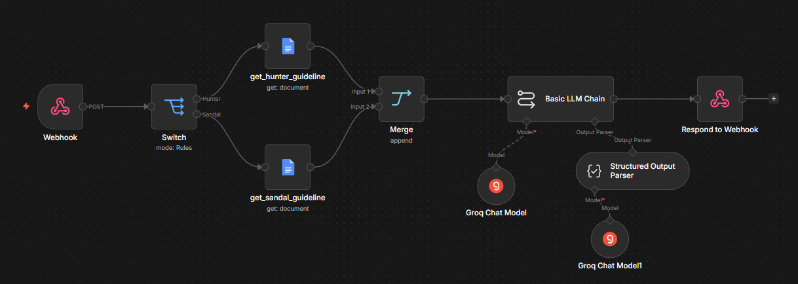
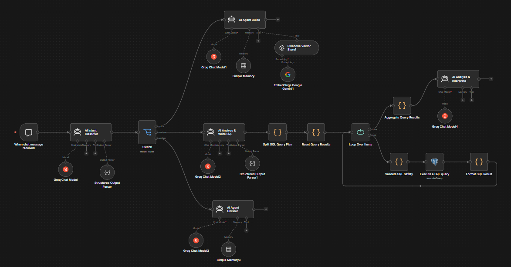

# Tài liệu n8n AI Workflows

Thư mục này lưu hai workflow n8n phục vụ các tính năng AI của Biti's Management System:

| Workflow | Chức năng | File import |
|---|---|---|
| AI Product Description Generator | Tạo hoặc chỉnh sửa mô tả sản phẩm theo guideline của từng dòng sản phẩm | [`AI Product Description Generator.json`](./AI%20Product%20Description%20Generator.json) |
| AI Assistant for Biti's | Phân loại câu hỏi, hướng dẫn sử dụng website bằng RAG và phân tích dữ liệu bằng SQL | [`AI Assistant for Biti's.json`](./AI%20Assistant%20for%20Biti's.json) |

Các file JSON là bản export có thể import trực tiếp vào n8n. Sau khi import, cần gán lại credential và kiểm tra URL webhook trước khi kích hoạt.

## 1. AI Product Description Generator



### Mục đích

Workflow nhận dữ liệu từ biểu mẫu thêm hoặc chỉnh sửa sản phẩm, đọc guideline nội dung phù hợp với danh mục, sau đó dùng mô hình ngôn ngữ để tạo mô tả tiếng Việt. Kết quả được chuẩn hóa thành JSON để frontend có thể điền trực tiếp vào trường mô tả.

Workflow hỗ trợ:

- `generate`: tạo mô tả mới từ thông tin sản phẩm.
- `revise`: chỉnh sửa mô tả hiện có theo góp ý của người dùng.

### Dữ liệu đầu vào

Frontend gửi `POST` đến webhook với cấu trúc chính:

```json
{
  "action": "generate",
  "source": "product_form",
  "form_mode": "create",
  "product_id": null,
  "output_language": "vi",
  "product": {
    "name": "Tên sản phẩm",
    "category": "Hunter",
    "collection": "Bộ sưu tập",
    "price_vnd": 1000000,
    "color": "Màu sắc",
    "highlight_features": "Đặc điểm nổi bật",
    "size": {
      "from": 35,
      "to": 44
    }
  },
  "current_description": null,
  "revision_comment": null
}
```

Khi `action` là `revise`, `current_description` chứa nội dung hiện tại và `revision_comment` mô tả yêu cầu chỉnh sửa.

### Luồng xử lý

1. **Webhook** nhận request `POST` từ `add_product.html` hoặc `edit_product.html`.
2. **Switch** đọc `body.product.category` để định tuyến:
   - `Hunter` đi đến `get_hunter_guideline`.
   - `Sandal` đi đến `get_sandal_guideline`.
3. **Google Docs** đọc tài liệu guideline tương ứng. Việc tách guideline giúp nội dung bám đúng đặc điểm và giọng điệu của từng dòng sản phẩm.
4. **Merge** hợp nhất hai nhánh về một cấu trúc đầu vào chung.
5. **Basic LLM Chain** kết hợp thông tin sản phẩm, guideline, mô tả hiện tại và yêu cầu chỉnh sửa.
6. **Groq Chat Model** tạo nội dung theo vai trò copywriter thương mại điện tử của Biti's.
7. **Structured Output Parser** ép kết quả về đúng schema. Một Groq model phụ được dùng để sửa output khi phản hồi ban đầu chưa hợp lệ.
8. **Respond to Webhook** trả kết quả cho frontend.

### Dữ liệu đầu ra

```json
{
  "description": "Nội dung mô tả sản phẩm hoàn chỉnh"
}
```

Prompt yêu cầu nội dung:

- Viết bằng tiếng Việt, giọng hiện đại và đáng tin cậy.
- Chỉ sử dụng dữ liệu đầu vào và guideline, không tự tạo công nghệ hoặc claim chưa được cung cấp.
- Trình bày rõ lợi ích, trải nghiệm sử dụng, thông số, lưu ý sử dụng và bảo quản.
- Khi chỉnh sửa, trả về nội dung hoàn chỉnh thay vì giải thích quá trình sửa.

### Credential cần thiết

| Credential | Mục đích |
|---|---|
| Groq API | Sinh mô tả và sửa output theo schema |
| Google Docs OAuth2 | Đọc guideline Hunter và Sandal |

### Giới hạn hiện tại

- `Switch` chỉ có rule cho `Hunter` và `Sandal`. Danh mục khác cần thêm rule hoặc nhánh guideline mặc định.
- Nếu Google Docs không truy cập được, workflow không có dữ liệu guideline để tiếp tục.
- Webhook production nên có xác thực, CORS phù hợp và giới hạn tần suất.

## 2. AI Assistant for Biti's



### Mục đích

Workflow là bộ xử lý phía sau trang `chatbot.html`. Mỗi câu hỏi được phân loại rồi chuyển đến một trong ba nhánh:

| Intent | Nội dung | Cách xử lý |
|---|---|---|
| `guide` | Hỏi cách thao tác trên website | Tra cứu tài liệu bằng Pinecone RAG |
| `analyze` | Hỏi doanh thu, đơn hàng, sản phẩm hoặc tồn kho | Lập kế hoạch SQL, truy vấn PostgreSQL và diễn giải kết quả |
| `unclear` | Câu hỏi mơ hồ hoặc ngoài phạm vi | Yêu cầu người dùng làm rõ |

### Dữ liệu đầu vào

```json
{
  "action": "sendMessage",
  "sessionId": "<uuid>",
  "chatInput": "<câu hỏi của người dùng>"
}
```

`sessionId` được frontend duy trì để các memory node giữ ngữ cảnh đúng trong cùng một cuộc hội thoại.

### Luồng xử lý chung

1. **When chat message received** nhận tin nhắn từ n8n Chat Trigger.
2. **AI Intent Classifier** dùng Groq và Structured Output Parser để trả về `intent`, `confidence`, `reason` và `user_question`.
3. **Switch** chuyển request sang nhánh `guide`, `analyze` hoặc `unclear`.

### Nhánh hướng dẫn sử dụng

1. **AI Agent Guide** nhận câu hỏi đã chuẩn hóa.
2. Agent gọi **Pinecone Vector Store** như một công cụ tra cứu tài liệu.
3. **Google Gemini Embeddings** chuyển câu hỏi thành vector để tìm các đoạn hướng dẫn liên quan.
4. **Simple Memory** lưu ngữ cảnh theo phiên.
5. Groq tạo câu trả lời từng bước dựa trên context tìm được.

Agent được yêu cầu không tiết lộ raw context, metadata, tên tool hoặc thông tin nội bộ. Nếu tài liệu không đủ, agent phải nói rõ chưa tìm thấy hướng dẫn phù hợp thay vì tự suy đoán.

#### Cập nhật kho kiến thức RAG

Workflow có pipeline nạp dữ liệu riêng:

1. Chạy manual trigger trong n8n.
2. Đọc tài liệu hướng dẫn từ Google Docs.
3. Data Loader chuyển nội dung thành document.
4. Gemini tạo embedding.
5. Pinecone lưu vector vào index `huong-dan-dung-website`.

Khi tài liệu nguồn thay đổi, cần chạy lại pipeline để đồng bộ kho kiến thức.

### Nhánh phân tích dữ liệu

1. **AI Analyze & Write SQL** chuyển câu hỏi thành một query plan gồm mục tiêu, danh sách truy vấn và hướng dẫn tổng hợp.
2. **Split SQL Query Plan** tách từng truy vấn thành item riêng.
3. **Reset Query Results** xóa dữ liệu kết quả tạm.
4. **Loop Over Items** lần lượt xử lý từng câu SQL.
5. **Validate SQL Safety** chỉ cho phép lệnh bắt đầu bằng `SELECT` hoặc `WITH`; chặn lệnh ghi dữ liệu và truy cập schema hệ thống.
6. **Execute a SQL query** chạy truy vấn bằng PostgreSQL credential.
7. **Format SQL Result** bổ sung mã truy vấn, mục đích và số dòng.
8. **Aggregate Query Results** gom kết quả của toàn bộ kế hoạch.
9. **AI Analyze & Interprete** diễn giải số liệu bằng tiếng Việt, ưu tiên kết luận và không hiển thị SQL cho người dùng.

Query plan có cấu trúc:

```json
{
  "analysis_goal": "Mục tiêu phân tích",
  "query_count": 1,
  "queries": [
    {
      "id": "q1",
      "purpose": "Mục đích truy vấn",
      "sql": "SELECT ..."
    }
  ],
  "final_instruction": "Yêu cầu tổng hợp kết quả"
}
```

Các quy tắc phân tích chính:

- Báo cáo sử dụng múi giờ `Asia/Bangkok`.
- Tổng số đơn tính bằng `COUNT(DISTINCT orders.id)`.
- Doanh thu lấy từ `orders.total_amount` và loại đơn bị hủy.
- Chỉ số sản phẩm lấy từ `order_items` nhưng loại item thuộc đơn bị hủy.
- Không kết luận tăng hoặc giảm khi chưa có truy vấn so sánh.
- Nếu người dùng không nêu thời gian, mặc định phân tích 30 ngày lịch gần nhất.

### Nhánh làm rõ

**AI Agent Unclear** không truy vấn dữ liệu và không tự suy đoán câu trả lời. Agent yêu cầu người dùng nói rõ họ muốn:

- Được hướng dẫn thao tác trên hệ thống; hoặc
- Phân tích số liệu kinh doanh.

Nếu câu hỏi ngoài phạm vi Biti's Management System, agent thông báo giới hạn hỗ trợ.

### Credential cần thiết

| Credential | Mục đích |
|---|---|
| Groq API | Intent router, guide agent, SQL agent, clarification agent và insight agent |
| Pinecone API | Lưu và tìm kiếm tài liệu hướng dẫn |
| Google Gemini API | Tạo embedding cho tài liệu và câu hỏi |
| Google Docs OAuth2 | Đọc tài liệu hướng dẫn website |
| PostgreSQL | Thực thi truy vấn phân tích chỉ đọc |

### Lưu ý bảo mật và vận hành

- PostgreSQL credential nên dùng user chỉ có quyền `SELECT`.
- Regex kiểm tra SQL chỉ là lớp bảo vệ bổ sung, không thay thế database permissions, statement timeout và giám sát truy vấn.
- Các node kết quả hiện dùng workflow static data toàn cục. Khi nhiều request chạy đồng thời, dữ liệu có thể bị ghi đè hoặc trộn giữa các execution. Khi triển khai production nên giữ kết quả trong dữ liệu riêng của từng execution.
- Chat Trigger công khai cần được bảo vệ bằng kiểm soát origin, rate limit và cơ chế xác thực phù hợp.
- Không commit API key, mật khẩu hoặc credential thật vào repository.

## Import và cấu hình trên n8n

1. Mở n8n và chọn **Import from File**.
2. Import từng file JSON trong thư mục này.
3. Gán lại toàn bộ credential bị thiếu.
4. Mở từng node Google Docs, Pinecone và PostgreSQL để kiểm tra document, index và database đích.
5. Kiểm tra model đang khả dụng trong tài khoản Groq và Gemini.
6. Chạy thử bằng test webhook hoặc chat trigger.
7. Kiểm tra schema response trước khi kết nối frontend.
8. Kích hoạt workflow và cập nhật production webhook URL trong frontend nếu URL thay đổi.

## File liên quan trong ứng dụng

| File | Liên hệ với workflow |
|---|---|
| `add_product.html` | Gọi workflow tạo mô tả khi thêm sản phẩm |
| `edit_product.html` | Gọi workflow tạo hoặc chỉnh sửa mô tả |
| `chatbot.html` | Gửi tin nhắn và `sessionId` đến AI Assistant |

